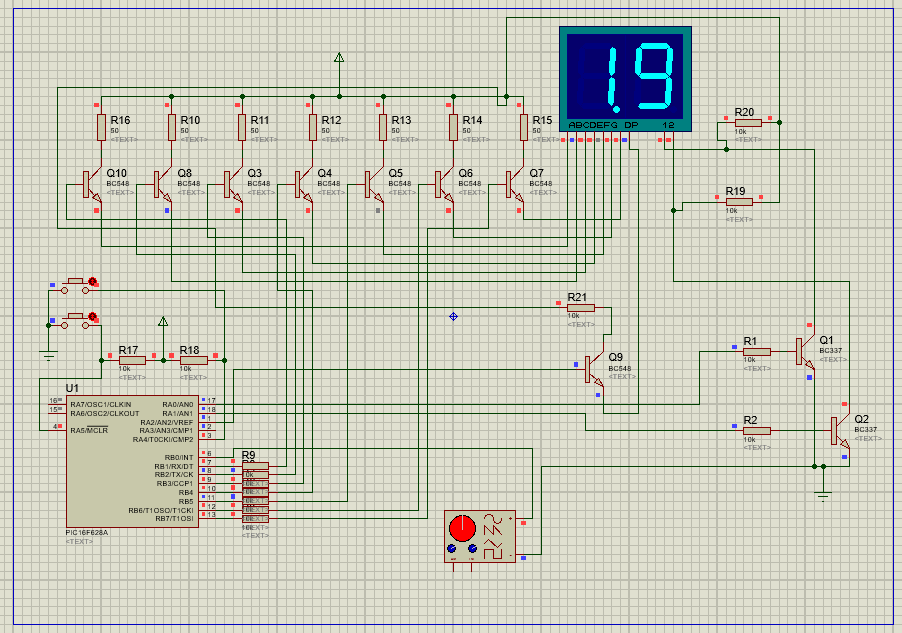

# Contagiros Digital - RPM Metter

Desenvolvido com microcontrolador PIC16F628A.

Realiza leituras de motores 1 - 2 - 4 - 6 cilindros.

De 500rpm até 30.000rpm.

Utiliza dois displays 7SEG.

Configuração de Brilho.

Configuração de Shift Light.

